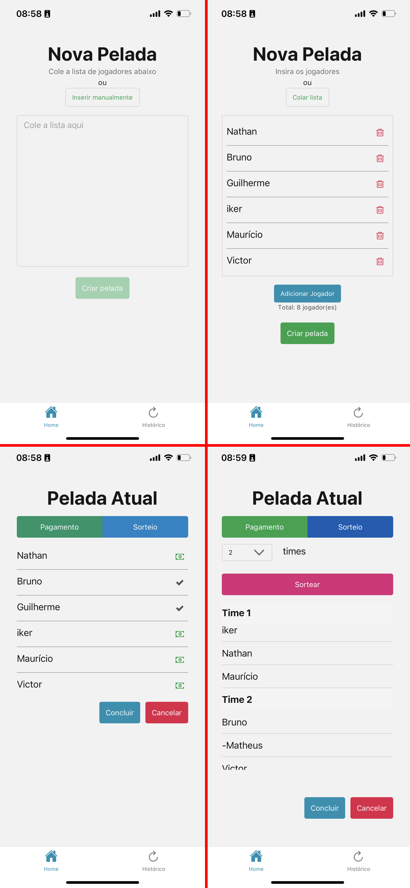

# PeladaFacilFutebol
A simple mobile app that manages casual soccer(or other sports) matches developed in React Native.

## Features
* Create Game
* Keep track of matches history
* Paste list functionality
* Draw Teams
* Manage player payments

## Tools
* React Native
* Expo
* Typescript
* Native Base UI Library
* Compromise (Natural Language Processing)